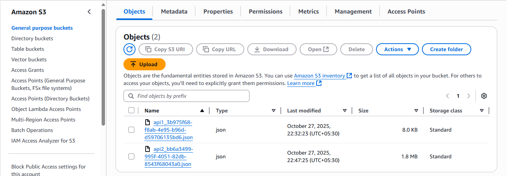
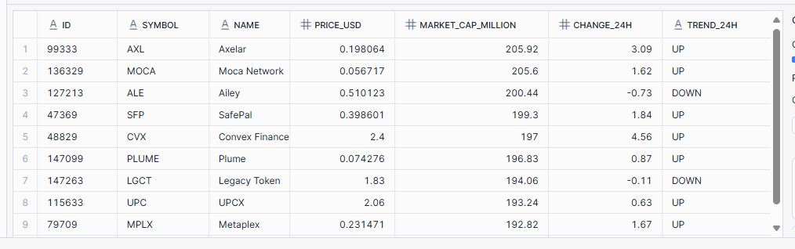
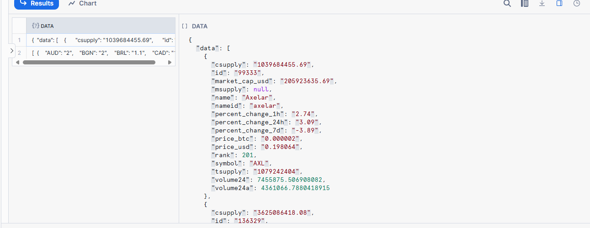
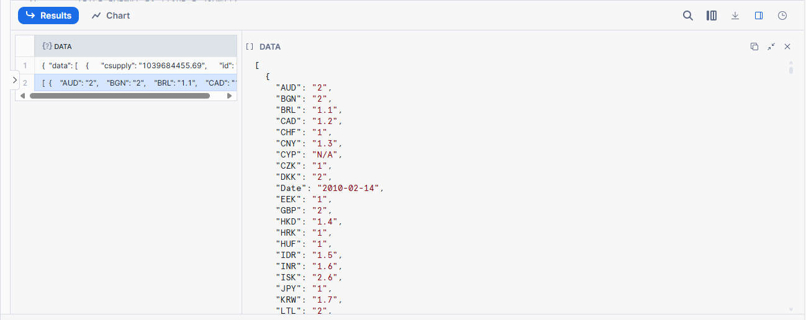

# Fetch API Data and Store in AWS S3

This project demonstrates how to fetch data from external APIs, process it using AWS Lambda, and store the results in Amazon S3.

## **APIs Used**

1. **CoinLore Cryptocurrency API**  
   Endpoint: https://api.coinlore.net/api/tickers/?start=200&limit=20

   Provides cryptocurrency market data such as price, market cap, and volume.

2. **COVID-19 Dataset**  
    Endpoint: https://raw.githubusercontent.com/datasets/covid-19/main/data/countries-aggregated.csv
    
    Contains aggregated COVID-19 data by country.

## **Workflow Overview**
- **Step 1:** Fetch data from the above APIs using AWS Lambda.
- **Step 2:** Process and store the data in JSON format.
- **Step 3:** Upload the processed files to Amazon S3.
- **Step 4:** Visualize the data using query tools.

## **Screenshots**

### 1. AWS Lambda Function Execution

### 2. Amazon S3 Bucket

### 3. CyptoCurrency After Transformation

### 4. Cryptocurrency Data (Raw JSON)

### 5. Covid-19 (Raw JSON)

### 6. Covid-19 Transformed Data

